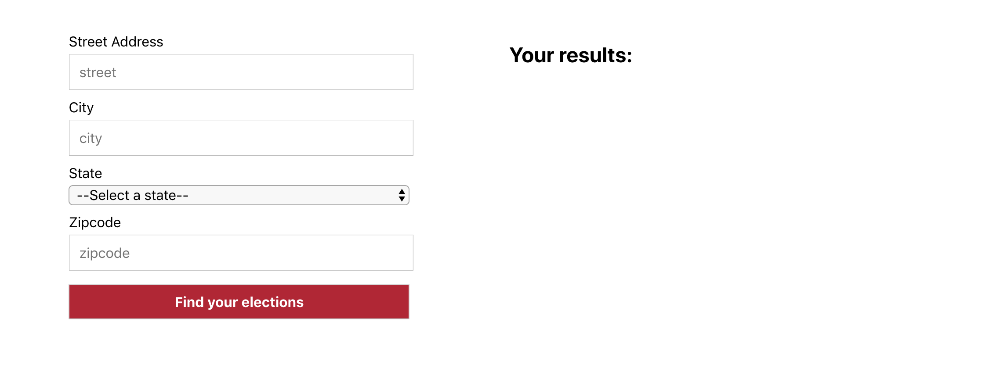
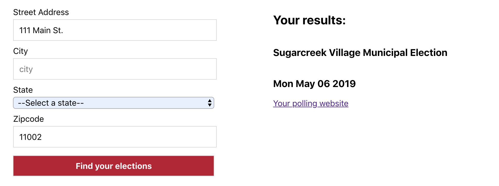

# Election Match


Election Match is a basic app that matches users to nearby elections based on their address. When the user submits an address form, the address is translated into OCD-IDs or [Open Civic Data division identifiers](https://opencivicdata.readthedocs.io/en/latest/data/datatypes.html), and then used to query the Democracy Works Elections API for upcoming elections in the user's area. Please use the [upcoming elections](https://github.com/democracyworks/dw-practical-upcoming-elections/wiki/Upcoming-Elections) link by Democracy Works to test current OCD_IDs that are in use.

Any elections returned are displayed for the user. A live proxy server is used as an intermediary between the DemWorks API and this client side app. The backend repo is [here](https://github.com/TMcMeans/election-match-backend) and currently hosted on Heroku.

## ⚙️ Initial Setup

OS X & Linux:

After cloning this repo type the following commands into your terminal to install dependencies and start your local server:

```
npm install
npm start
```

To view tests, quit your server (cmd + c) and type the following commands into your terminal:

```
npm test
```

## Features

The user is presented with an address form.


The user submits the form and their address is translated into some OCD-IDs. The Democracy Works Election API is queried for upcoming elections in their area. The user's view updates to display any elections returned by the API.


## Future Iterations

Planned enhancements include:

- Add more testing to functionality, in order to make the app more robust.
- Include a loader component for enhanced UX while the user is waiting for the DemWorks API to query election results.

## 🏗 Tech Stack List

- React
- Node.js
- Express
- Jest
- Enzyme
- Heroku

## 📥 How To Contribute

1. Fork this repo
2. Create your feature branch (`git checkout -b feature/thingamajig`)
3. Commit your changes (`git commit -m 'Added a cool doodad!'`)
4. Push to the branch (`git push origin feature/thingamajig`)
5. Create a new Pull Request

## 🚀 Core Contributors

**Tanjie McMeans**

- [Github](https://github.com/TMcMeans/)
